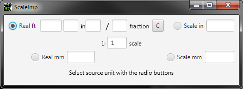

# ScaleImp
ScaleImp is a tool to convert dimensions between imperial and metric units, and at your chosen scale. A screenshot will probably help explain it best:

ScaleImp always calculates based on a source unit, and gives the other three dimensions. You can switch the source unit with the radio buttons. The program fully supports using just the keyboard.

To the right of the *Real ft* inputs you will see a little button with a 'C' on it. It is short for clear, like the button on calculator. Using it will clear all input from the four imperial boxes and move your cursor back to the ft box. This is to help your workflow as you enter dimensions one after another.

## What could I do with ScaleImp?

- Use it just to convert units from one system to another.
- Convert imperial dimensions off old plans into scale metric dimensions.
- Convert scale dimensions off a model back into real dimensions.

 

## Installation
ScaleImp is a Java 8 program. Download it it from the GitHub releases section. You will need to install the
[Java Runtime Environment](https://www.oracle.com/java/technologies/javase-jre8-downloads.html) from Oracle.

### Developers

Use [Apache Ant](https://ant.apache.org/) to build the software.

Note that there is currently no support for Java 9 and above.